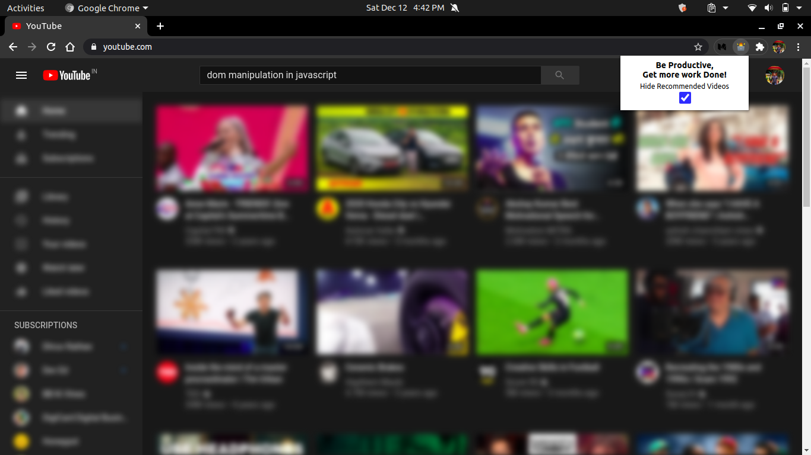
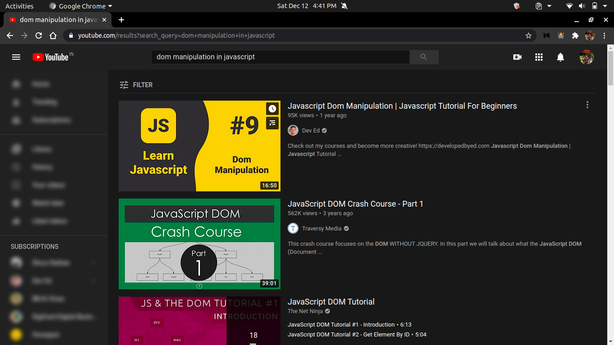
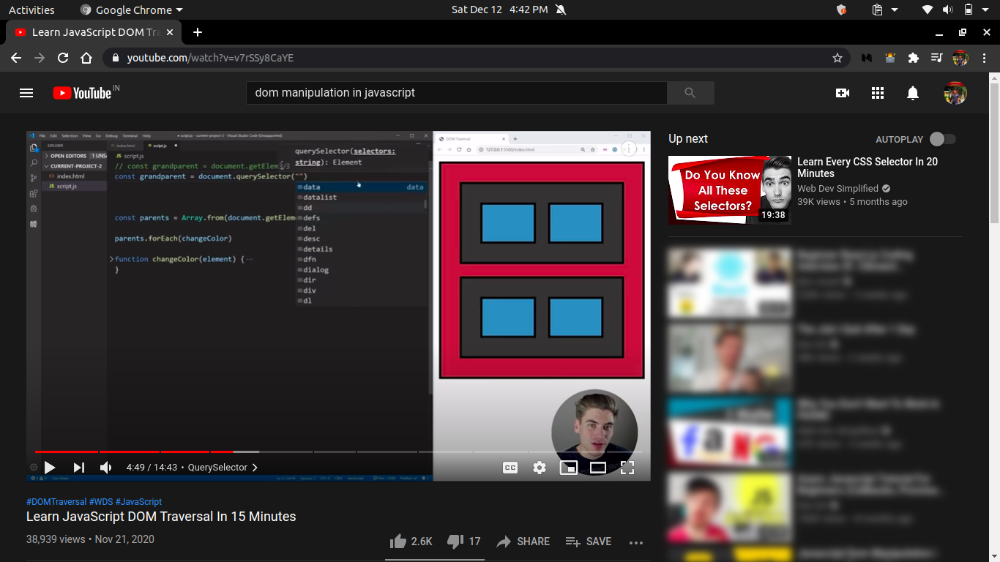
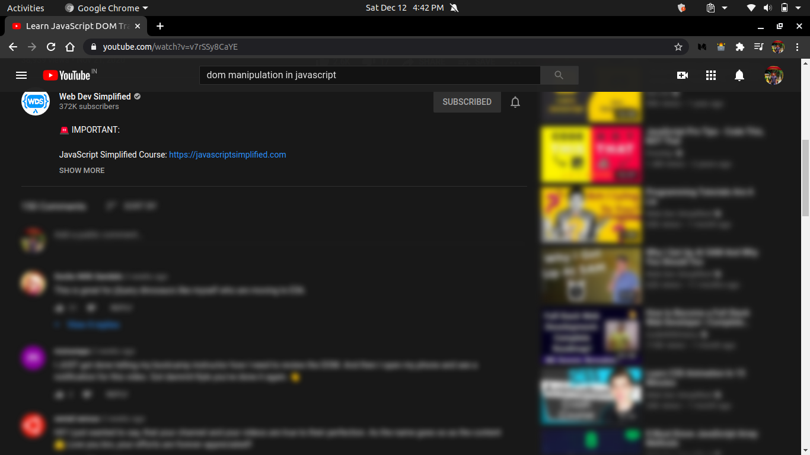

# YT-productive - Chrome extension

## About

- Interesting videos distracts you while you are trying to study from YouTube. YT-productive extension helps you by blocking all recommended videos. Be productive while you are working!

## How it Works

- Open YouTube page:

  - Click the extension button and
  - Click the check box of the extension popup

- Things you _can_ do while you are in _productive mode_ :

  - Search youtube on any topics
  - Watch full video from the search results
  - See upcoming video based on that video

- Things you _can't_ do while you are in _productive mode_ :
  - Can't open recommended Videos
  - Can't read any comments
  - Can't go to any other sections like (gaming, music, trending, etc.)

## Screen Shots

  

  

  

  

## How to install

- Download Zip file from github repository & unzip it
- Place it anywhere on your system or Create directory for extensions
- Now open `chrome://extensions/` in chrome
- And toggle the developer mode button
- Click on the _load unpacked_ button
- Now select the unzipped folder

It will install the extension in your chrome browser.
